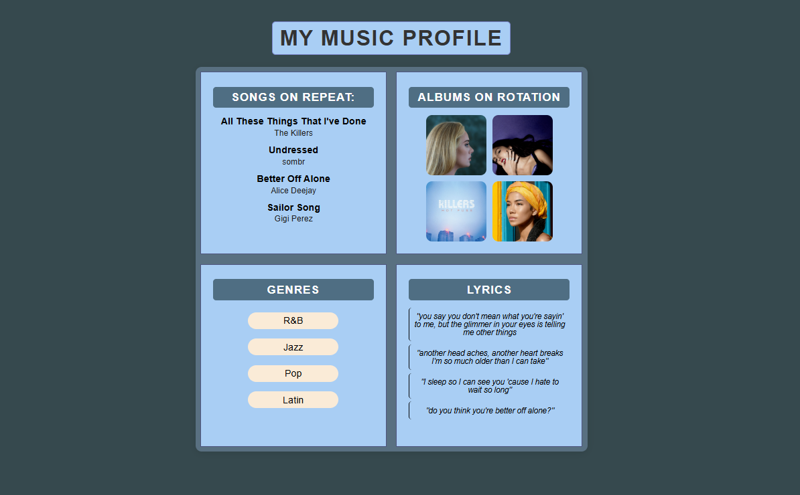

# On Repeat
A tiny, responsive music profile page built with plain **HTML + CSS**. It shows what I’m listening to, albums on rotation, favorite genres, and lyric snippets — in a simple 2×2 grid.




---

## Features
- **2×2 grid layout** (equal boxes, centered on the page)
- **Albums** with hover “lift” effect (and links out to Wikipedia)
- **Genres** with hover highlight
- **Lyrics** styled like quotes
- **Song titles** get a colored underline on hover
- Scales down nicely on smaller screens (mobile-friendly)

## Tech
- HTML5
- CSS (Flexbox + CSS Grid)
- No frameworks, no build tools

## Getting Started (Local)
1. Clone or download this repo
   ```bash
   git clone git@github.com:YOUR-USERNAME/on-repeat.git
   cd on-repeat
   
2. Open index.html
Windows: double-click index.html
From WSL:explorer.exe index.html

## Project Structure
```text
on-repeat/
├─ index.html
├─ styles.css
└─ assets/
   └─ screenshot.png
```

## What I Learned
- Building a fixed 2×2 layout with CSS Grid
- Using Flexbox for album rows/spacing
- Managing margins/padding so cards feel balanced
- Git + GitHub basics (SSH keys, repo setup, first push)

## Accessibility Notes (short)
- Clear heading hierarchy (page h1, labeled h2 section headers)
- Descriptive alt text for album covers (e.g., “Album cover: Adele — 30”)
- Good color contrast and readable font sizes
- Hover effects don’t hide content and feel subtle

## Credits
Album images from Wikipedia for demo/educational use.

Built by Jennifer
